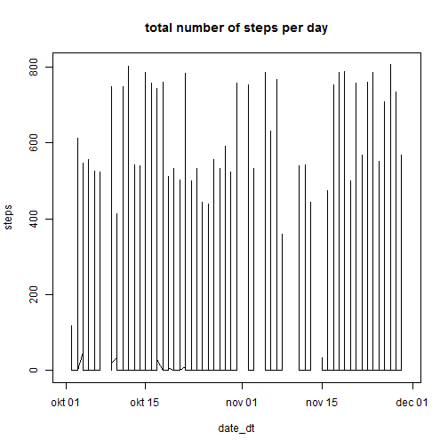
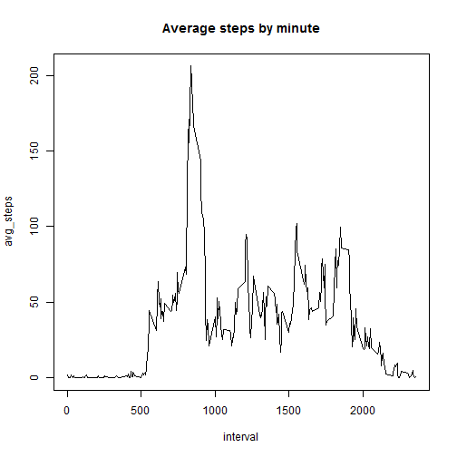
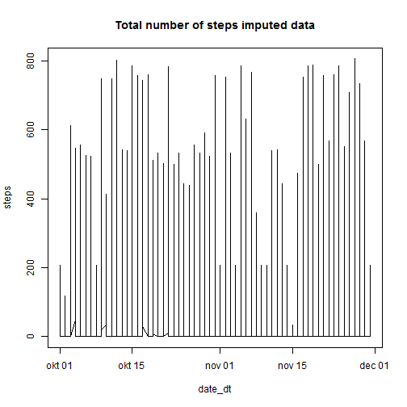
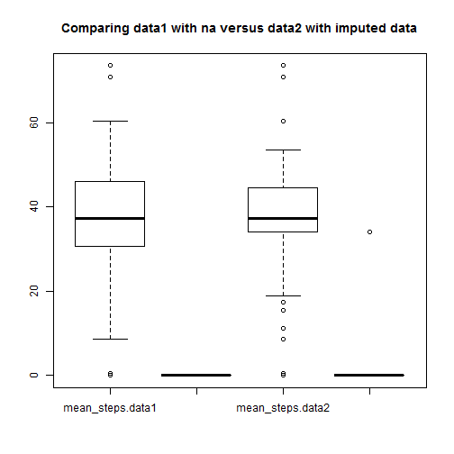
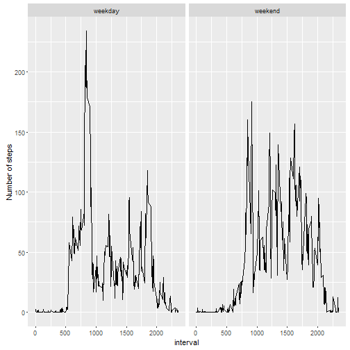

```r
fileUrl <- "https://d396qusza40orc.cloudfront.net/repdata%2Fdata%2Factivity.zip"
download.file(fileUrl,destfile = "data.zip")
data1 <- read.table(unz("data.zip", "activity.csv")
                   , header=T, sep=",",na.strings = "NA")
data1 <- data1 %>% mutate(date_dt = ymd(date))
```

## What is mean total number of steps taken per day?

For this part of the assignment, you can ignore the missing values in the dataset.

1. Make a histogram of the total number of steps taken each day


```r
with(data1,
     plot(date_dt,steps,type="l",main="total number of steps per day")
     )
```



2. Calculate and report the mean and median total number of steps taken per day

```r
data1 %>% select(date_dt,steps) %>% group_by(date_dt) %>% summarise(mean_steps = mean(steps,na.rm=T), median_steps = median(steps,na.rm=T))
```

```
## # A tibble: 61 × 3
##       date_dt mean_steps median_steps
##        <date>      <dbl>        <dbl>
## 1  2012-10-01        NaN           NA
## 2  2012-10-02    0.43750            0
## 3  2012-10-03   39.41667            0
## 4  2012-10-04   42.06944            0
## 5  2012-10-05   46.15972            0
## 6  2012-10-06   53.54167            0
## 7  2012-10-07   38.24653            0
## 8  2012-10-08        NaN           NA
## 9  2012-10-09   44.48264            0
## 10 2012-10-10   34.37500            0
## # ... with 51 more rows
```


## What is the average daily activity pattern?

1. Make a time series plot (i.e. type = "l") of the 5-minute interval (x-axis) and the average number of steps taken, averaged across all days (y-axis)


```r
subset <- data1 %>% select(interval,steps) %>%group_by(interval) %>% summarise(avg_steps = mean(steps,na.rm=T))

with(data=subset,
     plot(x=interval,y=avg_steps,type="l",main="Average steps by minute")
)
```



2. Which 5-minute interval, on average across all the days in the dataset, contains the maximum number of steps?


```r
subset <- subset %>% arrange(desc(avg_steps))
```
As you can see the interval 835 contains on average across all the days in the dataset the maximum number of steps: 206

## Imputing missing values

Note that there are a number of days/intervals where there are missing values (coded as NA). The presence of missing days may introduce bias into some calculations or summaries of the data.

1. Calculate and report the total number of missing values in the dataset (i.e. the total number of rows with NAs)


```r
summary(data1)
```

```
##      steps                date          interval         date_dt          
##  Min.   :  0.00   2012-10-01:  288   Min.   :   0.0   Min.   :2012-10-01  
##  1st Qu.:  0.00   2012-10-02:  288   1st Qu.: 588.8   1st Qu.:2012-10-16  
##  Median :  0.00   2012-10-03:  288   Median :1177.5   Median :2012-10-31  
##  Mean   : 37.38   2012-10-04:  288   Mean   :1177.5   Mean   :2012-10-31  
##  3rd Qu.: 12.00   2012-10-05:  288   3rd Qu.:1766.2   3rd Qu.:2012-11-15  
##  Max.   :806.00   2012-10-06:  288   Max.   :2355.0   Max.   :2012-11-30  
##  NA's   :2304     (Other)   :15840
```

2. Devise a strategy for filling in all of the missing values in the dataset. The strategy does not need to be sophisticated. For example, you could use the mean/median for that day, or the mean for that 5-minute interval, etc.

- I will re-use the mean for that 5-minute interval created earlier

3. Create a new dataset that is equal to the original dataset but with the missing data filled in.


```r
data2 <- inner_join(data1,subset)
```

```
## Joining, by = "interval"
```

```r
data2[is.na(data2$steps),1] <- data2[is.na(data2$steps),5]
data2 <- data2 %>%select(-avg_steps)
summary(data2)
```

```
##      steps                date          interval         date_dt          
##  Min.   :  0.00   2012-10-01:  288   Min.   :   0.0   Min.   :2012-10-01  
##  1st Qu.:  0.00   2012-10-02:  288   1st Qu.: 588.8   1st Qu.:2012-10-16  
##  Median :  0.00   2012-10-03:  288   Median :1177.5   Median :2012-10-31  
##  Mean   : 37.38   2012-10-04:  288   Mean   :1177.5   Mean   :2012-10-31  
##  3rd Qu.: 27.00   2012-10-05:  288   3rd Qu.:1766.2   3rd Qu.:2012-11-15  
##  Max.   :806.00   2012-10-06:  288   Max.   :2355.0   Max.   :2012-11-30  
##                   (Other)   :15840
```

4. Make a histogram of the total number of steps taken each day and Calculate and report the mean and median total number of steps taken per day. Do these values differ from the estimates from the first part of the assignment? What is the impact of imputing missing data on the estimates of the total daily number of steps?

```r
with(data2,
     plot(date_dt,steps,type="l",main="Total number of steps imputed data")
    )
```



```r
summary2 <-data2 %>% select(date_dt,steps) %>% group_by(date_dt) %>% summarise(mean_steps = mean(steps,na.rm=T), median_steps = median(steps,na.rm=T))
summary1 <-data1 %>% select(date_dt,steps) %>% group_by(date_dt) %>% summarise(mean_steps = mean(steps,na.rm=T), median_steps = median(steps,na.rm=T))
output <-inner_join(summary1,summary2, by="date_dt",suffix=c(".data1",".data2"))
boxplot(output[,-1],main="Comparing data1 with na versus data2 with imputed data")
```



Comparing the outputs, you can see the impact is not that big.

## Are there differences in activity patterns between weekdays and weekends?

For this part the weekdays() function may be of some help here. Use the dataset with the filled-in missing values for this part.

1. Create a new factor variable in the dataset with two levels - "weekday" and "weekend" indicating whether a given date is a weekday or weekend day.

```r
data3 <- data1 %>% mutate(day_in_week = wday(date_dt))
data3$type_of_day[data3$day_in_week ==1] <-"weekend"
data3$type_of_day[data3$day_in_week ==7] <-"weekend"
data3$type_of_day[is.na(data3$type_of_day)] <-"weekday"
data3$type_of_day <- as.factor(data3$type_of_day)
```

    
2.Make a panel plot containing a time series plot (i.e. type = "l") of the 5-minute interval (x-axis) and the average number of steps taken, averaged across all weekday days or weekend days (y-axis). See the README file in the GitHub repository to see an example of what this plot should look like using simulated data.

```r
summary3 <-data3 %>% select(interval,steps,type_of_day) %>% group_by(type_of_day,interval) %>% summarise(mean_steps = mean(steps,na.rm=T), median_steps = median(steps,na.rm=T))
qplot(interval,mean_steps,data=summary3,facets = .~type_of_day,geom = "line",ylab="Number of steps")
```



